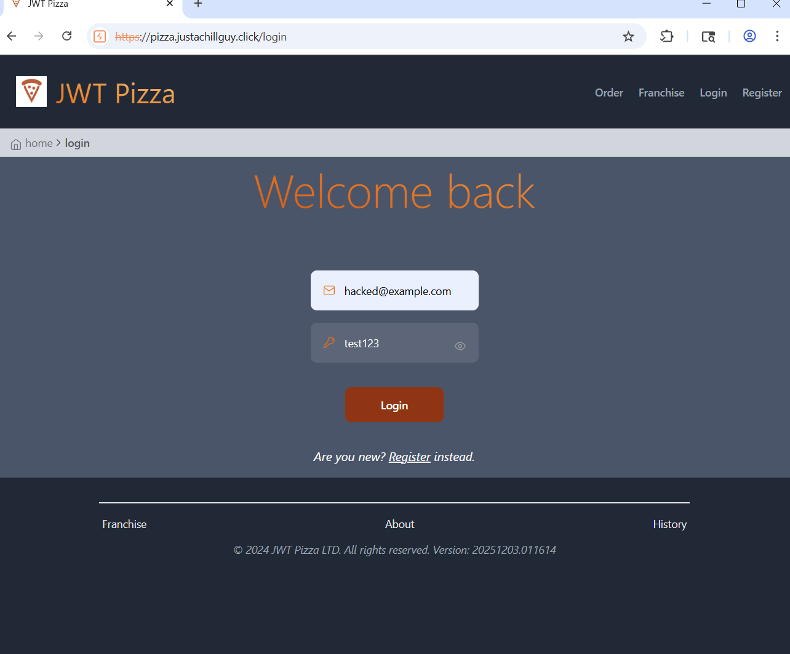
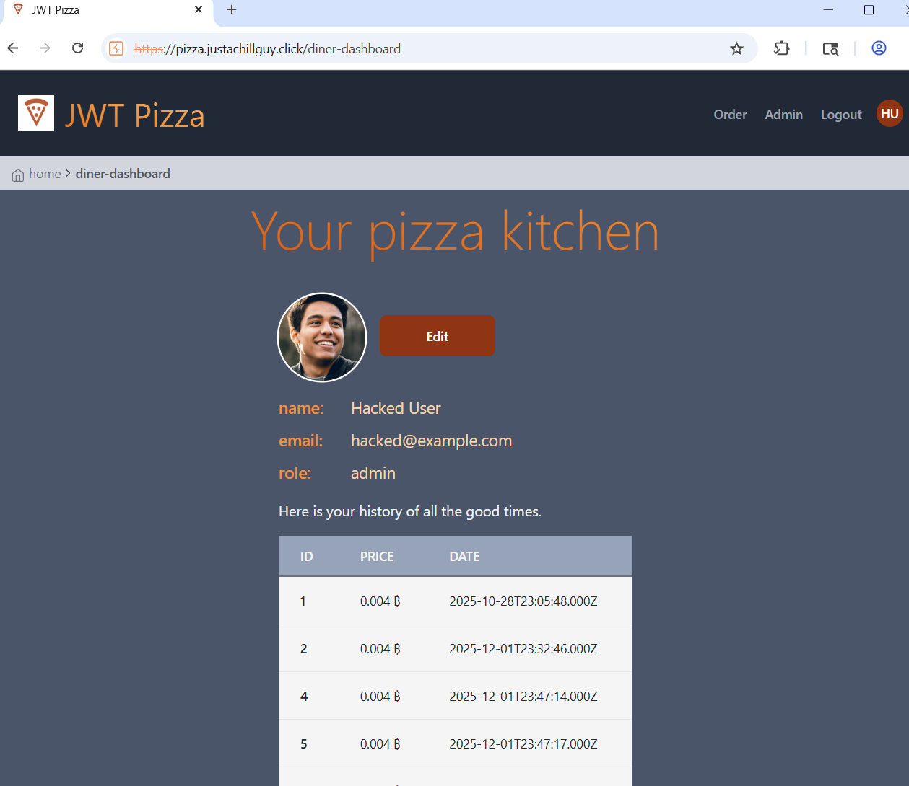

# Security Assessment Report

**Authors:** Samuel Soto & Jaiden Tripp  
**Date:** December 9, 2025

---

## 1. Self-Attack (Performed by: Samuel Soto)

### **Attack Details**

- **Date Executed:** 12/09/2025
- **Target Website:** `pizza.justachillguy.click`
- **Attack Type:** Broken Access Control
- **Severity:** **3** (High)

### **Description of Result**

An admin account was compromised by tampering with the admin user’s credentials using Burp Suite Repeater.  
The attacker (myself) was able to:

- Change the administrator’s password
- Log in as the admin with the new credentials
- Escalate authorization to administrator level
- Access sensitive administrative functionality
- Acquire significant internal data
- Cause performance impact due to unauthorized administrative access

This demonstrates a _horizontal and vertical privilege escalation_ vulnerability.

### **Evidence / Screenshots**

  

### **Corrections Made**

Although the attack was successful, it hinges on one assumption:  
**The attacker must know or obtain the admin’s identifying data (email + current password) to authenticate initially.**

Because I had valid admin credentials for testing, I demonstrated that any leak of admin login details would allow a malicious actor to:

- Log in as the admin
- Submit forged requests altering account information
- Lock out the real admin and take over the system

The vulnerability was fixed by ensuring:

- Users can **only update their own account**
- `roles`, `id`, and other sensitive fields are ignored server-side
- Admin privileges cannot be escalated from the client

---

## 2. Attack on Jaiden Tripp

### **Attack Details**

- **Date Executed:** 12/09/2025
- **Target Website:** `pizza.justachillguy.click`
- **Attack Type:**
- **Severity:**
- **Description of Result:**
- **Evidence / Screenshots:**  
  _(Insert images here if applicable)_
- **Corrections Made (if successful):**

---
